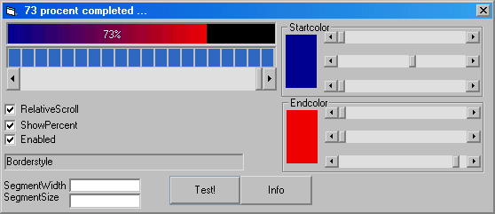



## exProgressbar

### Description

a horizontal scrollbar on which you can set textcolor, startcolor and endcolor

You have the ability to show the percentage.

You can choose if the endcolor is relative to the width, or absolute
 
### More Info
 

             |
---                |---
**Submitted On**   |2002-10-28 14:47:04
**By**             |[Jerous](https://github.com/Planet-Source-Code/PSCIndex/blob/master/ByAuthor/jerous.md)
**Level**          |Intermediate
**User Rating**    |4.9 (39 globes from 8 users)
**Compatibility**  |VB 6\.0
**Category**       |[Custom Controls/ Forms/  Menus](https://github.com/Planet-Source-Code/PSCIndex/blob/master/ByCategory/custom-controls-forms-menus__1-4.md)
**World**          |[Visual Basic](https://github.com/Planet-Source-Code/PSCIndex/blob/master/ByWorld/visual-basic.md)
**Archive File**   |[exProgress14884610282002\.zip](https://github.com/Planet-Source-Code/jerous-exprogressbar__1-40229/archive/master.zip)

